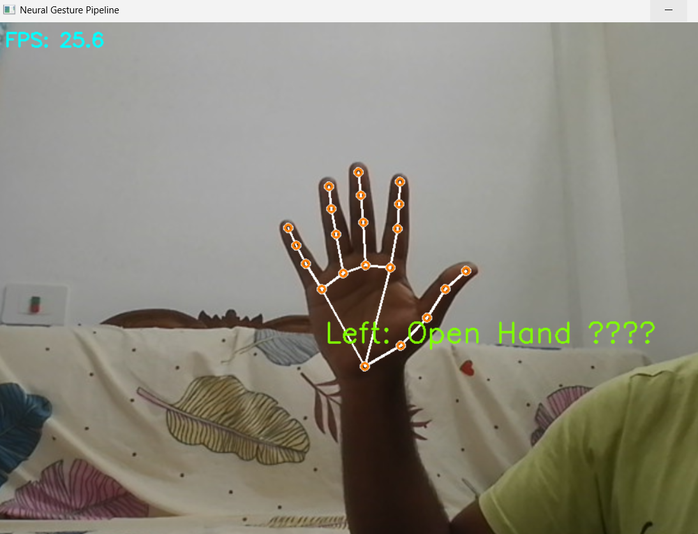
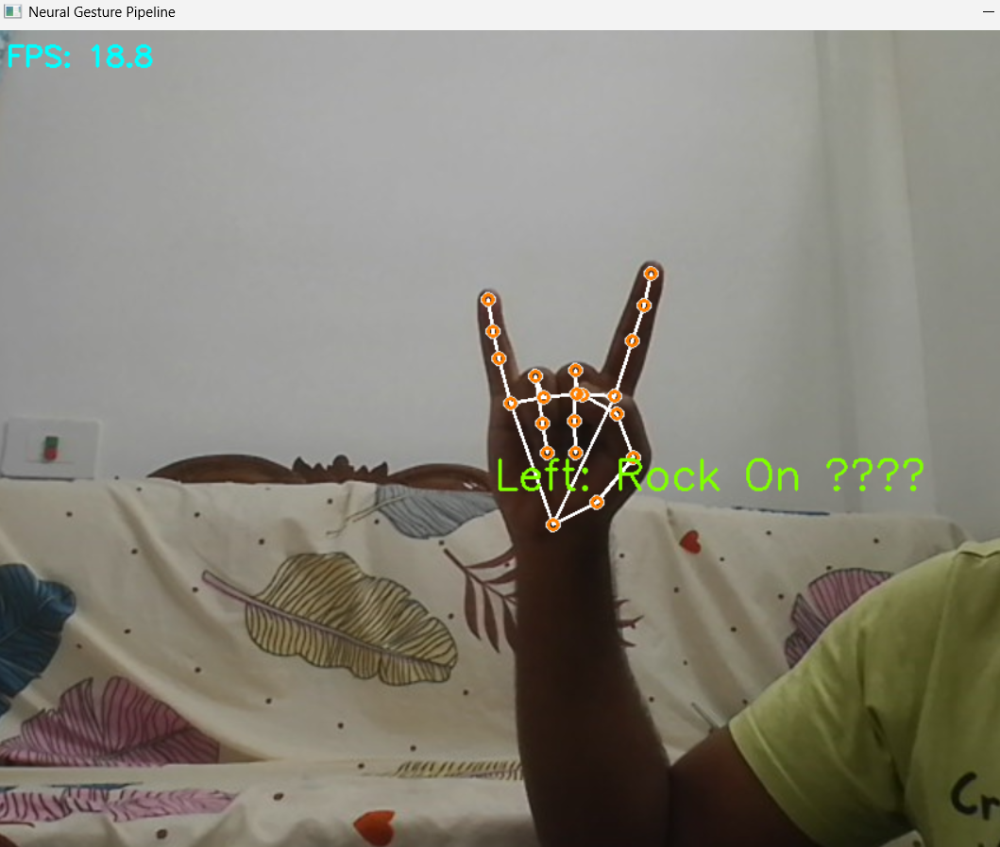
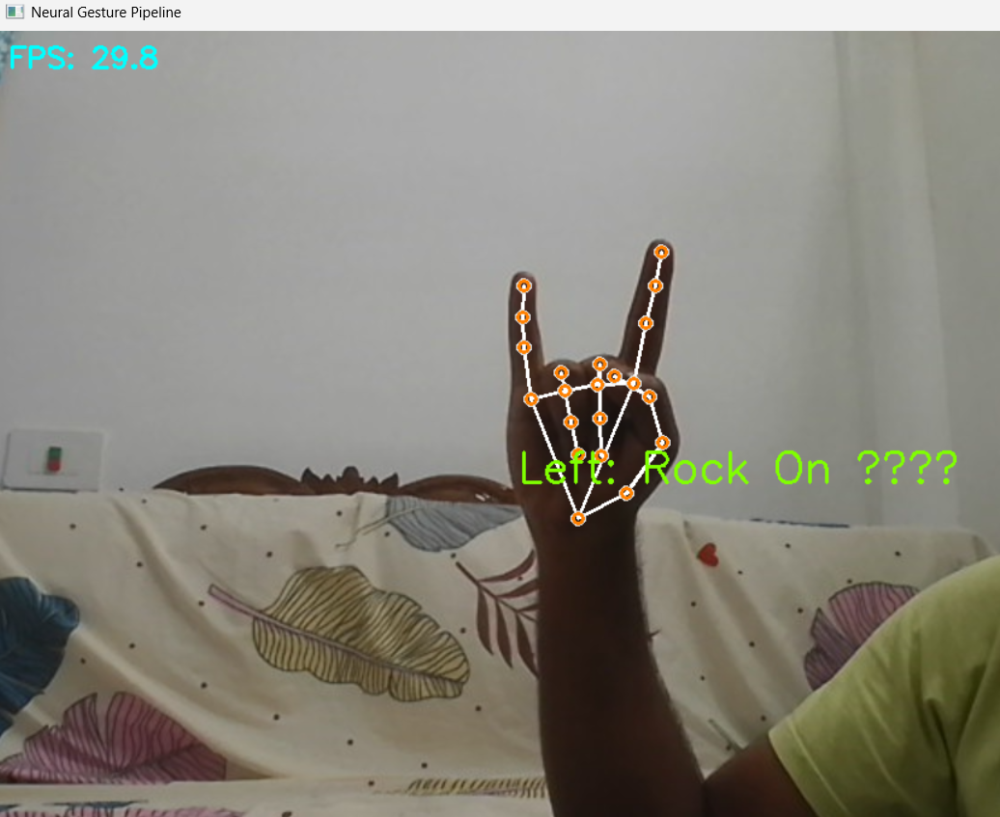
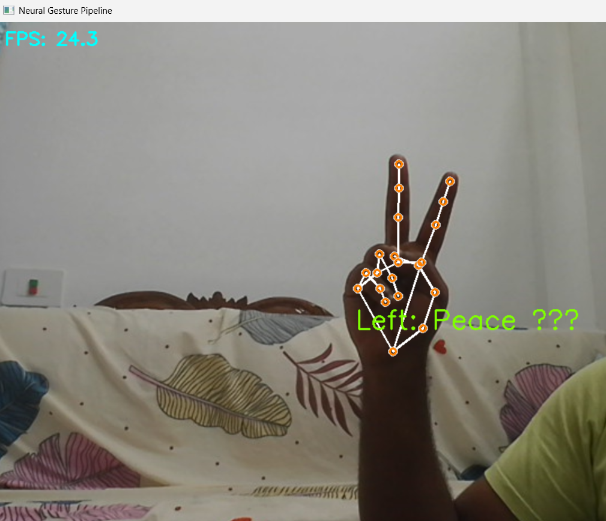

<div align="center">

# ✋ Neural Gesture Pipeline

### Real-Time Hand Gesture Recognition using Python, OpenCV & MediaPipe

Detect and classify hand gestures directly from a webcam feed using computer vision and machine learning techniques.


[](https://neural-gesture-pipeline-wj2p.vercel.app)


</div>

---

## 📌 Overview

Neural Gesture Pipeline is a real-time gesture recognition system that uses **MediaPipe Hand Tracking** and **OpenCV** to detect hand landmarks and identify common gestures. It includes both a local python pipeline and a premium **Next.js Web Dashboard** for browser-based real-time tracking, metrics visualization, and live feedback.

🚀 **Live Web Dashboard:** [https://neural-gesture-pipeline-wj2p.vercel.app](https://neural-gesture-pipeline-wj2p.vercel.app)

The project demonstrates the complete gesture-recognition workflow:

```text
Webcam Input
     ↓
Hand Detection
     ↓
Landmark Extraction
     ↓
Gesture Classification
     ↓
Output Display (Local & Web Dashboard)
```

---

## ✨ Features

✅ **Real-Time Webcam Processing:** High FPS tracking directly in your browser or local window.

✅ **Accurate Hand Landmark Detection:** Extracts 21 precise 3D coordinates per hand.

✅ **Premium Web Dashboard:** A sleek, glassmorphic Next.js portal including:
* **Live Detection Page** using webcams securely over HTTPS.
* **Landmarks Visualiser** for debugging coordinates in real time.
* **Logs & Analytics Portal** to monitor and store detected gestures.
* **Settings Panel** to tweak confidence thresholds.

✅ **Supported Gestures:** Open Hand, Fist, Pointing, and Finger Counting.

✅ **Lightweight & Modular:** Easily expandable codebase.

---

## 🛠️ Tech Stack

| Technology | Purpose |
|------------|---------|
| Next.js / TypeScript | Web Dashboard Frontend |
| React / Recharts | Web UI & Analytics Charts |
| MediaPipe | Hand Landmarker Models |
| Python / OpenCV | Local Detection Pipeline |
| NumPy | Numerical Operations |

---

## 📂 Project Structure

```text
Neural-Gesture-Pipeline/
│
├── gesture.py             # Python command-line/local OpenCV pipeline
├── requirements.txt       # Python dependencies
├── gesture_pipeline/      # Python detector module
│   ├── config.py          # Python configuration parameters
│   └── detector.py        # Hand Landmarker module
│
├── dashboard/             # Next.js web application (Dashboard)
│   ├── src/               # Application source code
│   └── package.json       # Web dependencies and scripts
│
├── assets/                # Documentation assets and screenshots
└── README.md
```

---

## 🚀 Installation

### 1. Clone Repository

```bash
git clone https://github.com/Agniiiiiman/Neural-Gesture-Pipeline.git
cd Neural-Gesture-Pipeline
```

### 2. Create Virtual Environment

```bash
python -m venv venv
```

Activate:

**Windows**

```bash
venv\Scripts\activate
```

**Linux / macOS**

```bash
source venv/bin/activate
```

### 3. Install Dependencies

```bash
pip install opencv-python mediapipe numpy
```

---

## ▶️ Run the Project

```bash
python gesture.py
```

Press **Q** to quit the application.

---

## 🧠 How It Works

### Step 1 — Capture Video

The webcam continuously captures frames.

### Step 2 — Detect Hands

MediaPipe detects the hand and extracts 21 landmarks.

### Step 3 — Analyze Finger Positions

The system checks whether each finger is open or closed.

### Step 4 — Classify Gesture

Based on landmark positions, the gesture is recognized.

### Step 5 — Display Result

The detected gesture is shown on the screen in real time.

---

## 🎯 Supported Gestures

| Gesture | Recognition |
|----------|-------------|
| ✊ Fist | All fingers closed |
| 🖐 Open Hand | All fingers open |
| ☝ Pointing | Index finger raised |
| 🔢 Finger Count | Counts raised fingers |

---

## 📸 Demo

<div align="center">
  
  
  <br/><br/>
  
  
</div>


---

## 🔮 Future Improvements

- Sign Language Recognition
- Gesture-based Mouse Control
- Gesture-based Volume Control
- Deep Learning Classification (TensorFlow/PyTorch)
- Multi-Hand Recognition
- Custom Gesture Training

---

## 🤝 Contributing

Contributions are welcome.

1. Fork the repository
2. Create a new branch
3. Commit your changes
4. Open a Pull Request

---

## 👨‍💻 Author

### Agniv Bhattacharjee

🎓 B.Tech CSE (AI & ML)

🔗 GitHub: https://github.com/Agniiiiiman

---

## ⭐ Support

If you found this project useful, consider giving it a ⭐ on GitHub.

---

<div align="center">

### "Bridging Human Interaction and AI through Gesture Recognition"

⭐ Star the repository if you like the project!

</div>
